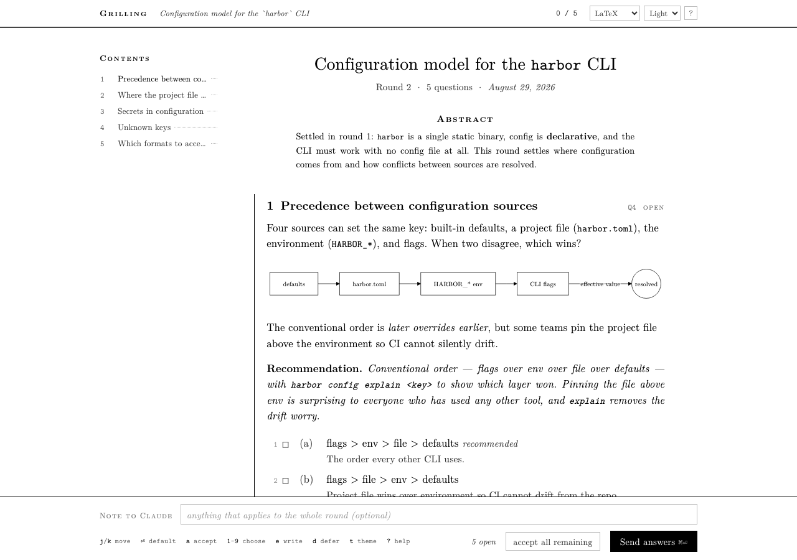
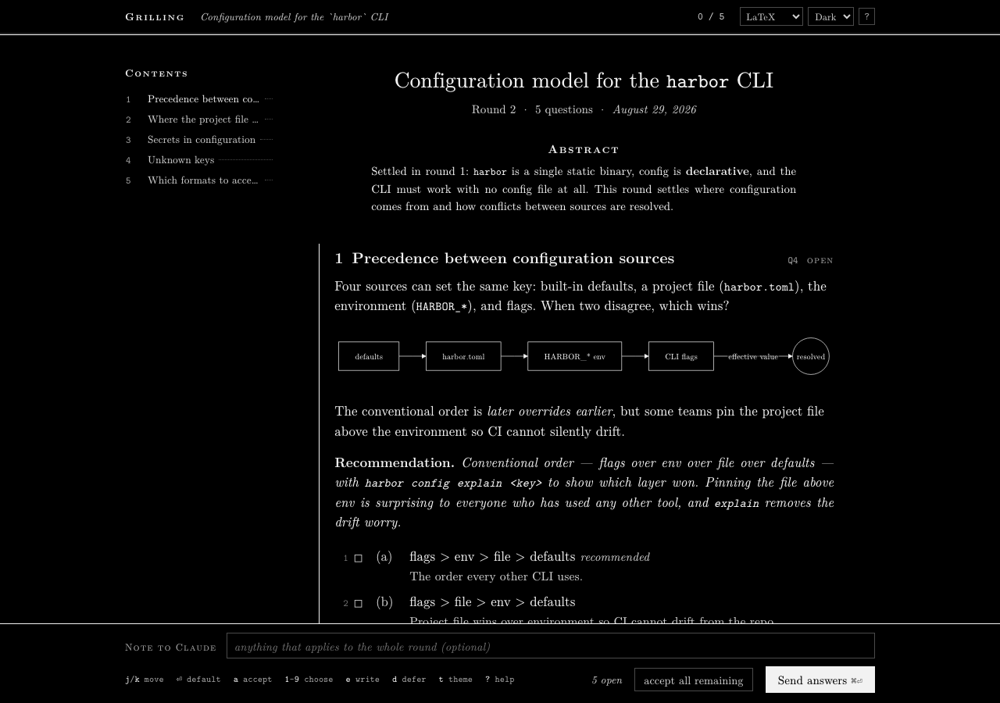
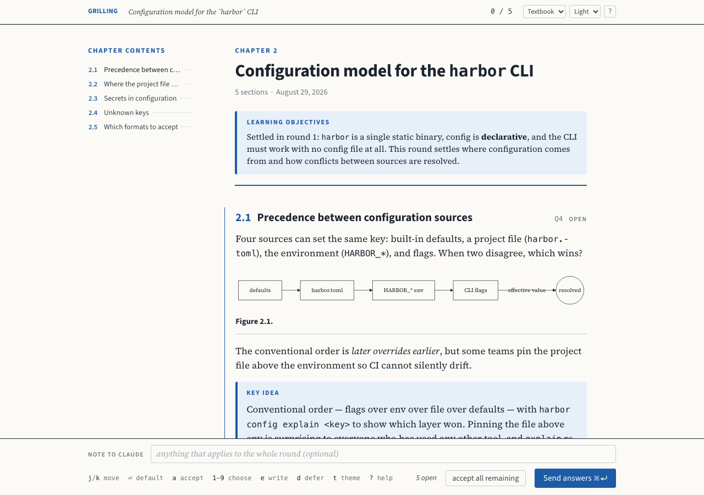
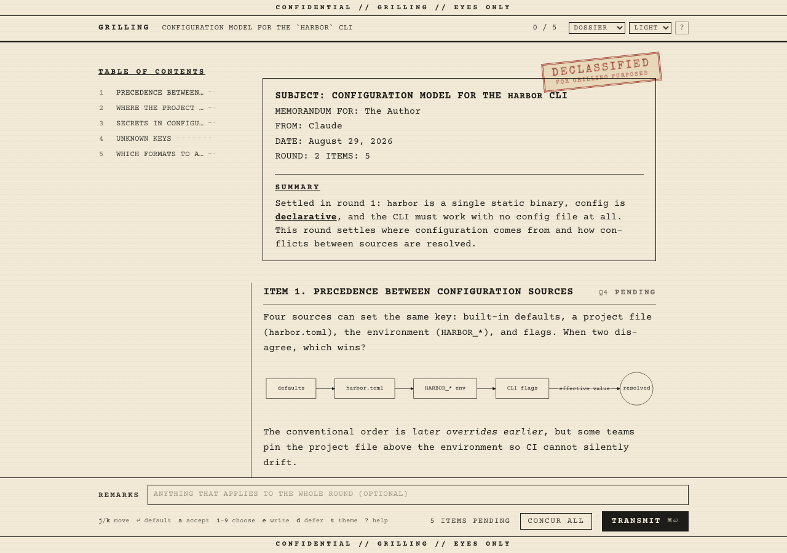
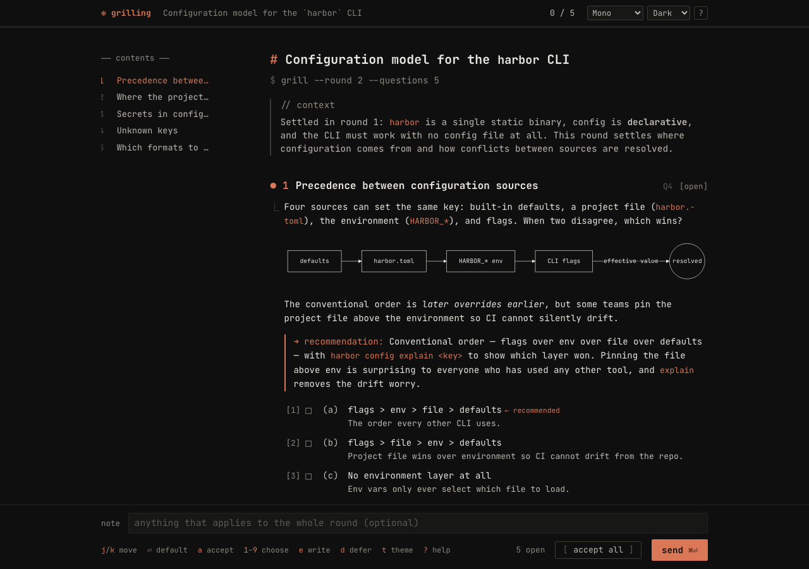

# grill-me-popup

**Answer a whole round of "grill me" questions in a browser popup instead of the terminal.**
A zero-dependency MCP server plus a Claude Code skill. Accept, choose, write, or defer each question — mostly without leaving the keyboard — and the answers land back in the conversation as if you had typed them.

<p align="center">
  
</p>

## The problem

[Matt Pocock's `grill-me` skill](https://github.com/mattpocock/skills) is the best planning tool I have used with a coding agent: it interviews you relentlessly about a plan, working a *design tree* in rounds, until nothing is silently assumed. Its newer versions ask the **whole frontier at once** — every question whose prerequisites are settled — which is exactly right for the method: you see the shape of the round, and decisions that hang together get decided together.

It also makes each round a chore to answer. A round is routinely eight to twelve questions, each with a recommendation and often a set of options, and the reply is one long terminal message. In practice that means:

- you retype "agree" ten times, or write "agree to all except…" and hope the model parses the exception;
- an answer you meant to *postpone* reads as silence, and silence reads as consent;
- you lose your place in a wall of scrollback while composing, and any question you skipped is gone;
- Claude Code's built-in `AskUserQuestion` can't hold it — it's capped at four questions, has no Markdown, no per-question "defer", and no free-text alongside a choice.

The interview method wants **room to breathe**. The answering surface should stay **cheap to fill out**. Those pull in opposite directions in a terminal.

## The fix

`grill_round` is an MCP tool that takes the whole round — questions, bodies, recommendations, options — and renders it as a document in a small browser window. It **blocks** until you submit, then returns your answers as the tool result. From Claude's point of view nothing changed: it asked, you answered.

```
Claude ──── grill_round({ round, topic, context, questions[] }) ────▶  popup
                                                                        │
                                              accept · choose · write · defer
                                                                        │
      ◀──── "The user answered round 2 … Q4 chose (A) … Q7 deferred" ───┘
```

What that buys you:

| | terminal | popup |
|---|---|---|
| Accept a recommendation | retype "agree" | `a`, or `Enter` |
| Pick from (A)/(B)/(C) | prose | `1`/`2`/`3` — the label comes back resolved |
| Partial agreement | prose | choose or accept **and** add a note |
| Not ready to decide | silence, which reads as consent | `d` — returned as *still open*, re-asked next round |
| Answer twelve questions | one long message; easy to skip one | progress meter, table of contents, nothing lost |
| Diagrams, tables, code | none | Markdown, including ` ```mermaid ` blocks |
| End of session | window lingers | `grill_close` — the popup closes itself ∎ |

Every action auto-advances to the next open question, so a typical round is a dozen keystrokes: `Enter Enter 2 Enter d e …type… Enter ⌘⏎`.

It looks like a paper by default, on purpose — Computer Modern, pure white (or pure black in dark mode), numbered sections, a contents column, the recommendation set as a theorem. Deciding things feels different when the page looks like something you'd cite. Three more themes are a keystroke away — see [Themes](#themes).

## Install

Requires Node ≥ 20 and a browser (Chrome gives the nicest result — a chromeless app window). Nothing to `npm install`; the browser assets are vendored.

### As a Claude Code plugin (skill + MCP server in one step)

```bash
claude plugin marketplace add bookernath/grill-me-popup
claude plugin install grill-me-popup@bookernath
```

Restart Claude Code. You now have the `grill` MCP server and the `/grill-me-popup:grill-popup` skill.

### Manually

```bash
git clone https://github.com/bookernath/grill-me-popup ~/grill-me-popup
claude mcp add --transport stdio --scope user grill -- node ~/grill-me-popup/server.mjs
mkdir -p ~/.claude/skills && ln -s ~/grill-me-popup/skills/grill-popup ~/.claude/skills/grill-popup
```

`--scope user` makes it available in every project. Drop the flag to register it for the current project only.

## Use

Say **"grill me on …"**, or invoke the skill directly:

```
/grill-popup the caching layer in this PR
```

A window opens with round 1. Work down the page, press **⌘⏎** to send, and the window waits for round 2. When the frontier is empty Claude calls `grill_close`, the window shows ∎ and closes, and Claude writes the shared understanding out in the terminal for you to confirm.

> **Already have `mattpocock/skills` installed?** Keep it. The server tells Claude to use the popup whenever a grilling session is running, so `/grill-me` and `/grill-with-docs` pick it up automatically. This repo's skill is for when you want a single install with the method included; it is a lightly edited copy of the upstream `grilling` skill (MIT) with the popup instructions added.

### Keyboard

Press `?` in the popup for the full sheet.

| Keys | |
|---|---|
| `j` `k` · `↓` `↑` | next / previous question |
| `n` `p` | next / previous *open* question |
| `Enter` | take the default — the recommended option, or the recommendation — and advance |
| `a` | accept the recommendation |
| `1` … `9` | choose option (a) … (i) |
| `d` | defer to a later round |
| `e` · `i` · `/` | write an answer (`Enter` finishes and advances, `⇧Enter` is a newline, `Esc` backs out) |
| `⇧A` | accept every remaining recommendation |
| `⌘⏎` · `Ctrl⏎` | send the round |
| `t` · `⇧T` | next / previous theme |

The whole page is also clickable, and drafts autosave per round — if the window gets closed mid-round it is reopened once with everything still filled in.

## Themes

Four looks, each with a light and a dark palette. Pick one from the dropdown in the header, press `t` to cycle, or set a default with `GRILL_THEME`. The choice is remembered per browser; `?skin=mono&scheme=dark` on the URL overrides both.

| | |
|---|---|
| **LaTeX** *(default)* — New Computer Modern, numbered sections, the recommendation as a theorem, ∎ at the end. Pure white / pure black. |  |
| **Textbook** — Source Serif body, Source Sans headings, one blue accent. Rounds are chapters, questions are sections (`2.1`), the recommendation is a *Key idea* box, options are a *Checkpoint*, diagrams get *Figure 2.1* captions. |  |
| **Dossier** — Courier Prime on aged paper, classification banners top and bottom, a memorandum header, a red *Declassified* stamp. Questions are *items*, recommendations are *assessments*, options are *courses of action*; you *concur*, *table*, and *transmit*. |  |
| **Mono** — JetBrains Mono, terminal dark, Claude's coral accent, `⏺`/`⎿` markers and `[ bracketed ]` buttons. For when you'd rather not leave the feel of the terminal you came from. |  |

## The tools

### `grill_round`

```ts
{
  round?: number,          // 1, 2, 3 …
  topic?: string,          // one line; rendered as the document title
  context?: string,        // Markdown; rendered as the abstract — what's settled so far
  timeoutSeconds?: number, // default 3600
  questions: [{
    id: string,            // "Q4" — shown in the margin
    title: string,         // section heading
    body?: string,         // Markdown (GFM tables, code, blockquotes, ```mermaid)
    recommendation?: string, // Markdown; enables one-key Accept
    options?: [{ key?: "A", label: string, detail?: string, recommended?: boolean }],
    multi?: boolean        // allow several options at once
  }]
}
```

Returns plain text the model can act on directly — per question, one of:

| status | meaning |
|---|---|
| `accepted` | took the recommendation as written |
| `accepted_with_note` | took it, with a qualification (quoted) |
| `chose` | picked option(s), resolved to their labels, plus any note |
| `answered` | wrote their own answer (quoted) |
| `deferred` | explicitly **not settled** — re-ask in a later round |
| `unanswered` | left open — re-ask |

…followed by an instruction to recompute the frontier and either call `grill_round` again or, if the frontier is empty, call `grill_close`.

Nothing here can hang a turn. Closing the window returns *"the user closed the popup — fall back to the terminal"*; so does the timeout. Neither is treated as agreement.

### `grill_close`

```ts
{ message?: string, keepOpen?: boolean }
```

The terminal state. The popup shows the message under a ∎, cancels any round still open, and closes itself (`keepOpen: true` leaves it on screen). Call it when the frontier is empty or the user stops early.

## Configuration

All optional, all environment variables on the server process (`env` in your MCP config):

| env | default | |
|---|---|---|
| `GRILL_TIMEOUT_SECONDS` | `3600` | default wait per round (10 s floor) |
| `GRILL_THEME` | `latex` | default theme: `latex`, `textbook`, `dossier`, `mono` (the dropdown / `t` override it per browser) |
| `GRILL_SCHEME` | `auto` | `light` or `dark` to stop following the OS |
| `GRILL_BROWSER` | Chrome app window | an app name (`Safari`, `Arc`, `firefox`), or `none` to print the URL on stderr instead |
| `GRILL_FOCUS` | on | `0` stops the window being raised on each new round (macOS) |
| `GRILL_AUTOCLOSE` | on | `0` never closes the window from the server side |
| `GRILL_PORT` / `GRILL_TOKEN` | ephemeral | pin them for debugging |
| `GRILL_NO_OPEN` | off | `1` never launches a browser (tests) |
| `GRILL_DEBUG` | off | `1` traces to stderr |

The HTTP server binds `127.0.0.1` on an ephemeral port, is `unref`'d so it never keeps the MCP process alive, and gates every page/SSE/submit route on a per-process random token. Vendored assets are served from `/vendor/` with the path pinned inside that directory.

## Good to know

- **Long rounds get backgrounded.** Claude Code moves any MCP call that runs past ~2 minutes into a background task and delivers the result as a notification when you submit. This is harmless — Claude keeps working (fact-finding, reading code) while you answer — but the answer arrives as a task notification rather than an inline tool result.
- **One window per session.** Later rounds are pushed into the same window over SSE; you don't get a new popup per round.
- **Chrome app windows.** On macOS with Chrome installed the popup opens as an `--app` window (no tabs, no URL bar) in your running Chrome profile. Anything else falls back to your default browser.
- **Diagrams are lazy.** `mermaid.min.js` is 3.5 MB and only loads when a round actually contains a ` ```mermaid ` block; they render in monochrome to match the page.

## Develop

```bash
npm test          # 53 checks: real MCP handshake over stdio + real HTTP/SSE, no browser
npm run preview   # open the popup with a sample round (GRILL_NO_OPEN=1 to just print the URL)
npm run vendor    # re-fetch the pinned browser assets
```

`ui.html` is the whole front end (no build step). `ui-server.mjs` owns the window lifecycle; `server.mjs` speaks MCP.

## Contributing

Issues and pull requests are welcome. `npm test` runs the full suite without a browser; `npm run preview` opens the popup with a sample round so you can see a change in the real UI.

## Credits

The interview method is [Matt Pocock's](https://github.com/mattpocock/skills) `grilling` skill, MIT. This repo only changes the surface it is asked through. Typefaces: New Computer Modern (GUST FL), Source Serif 4 / Source Sans 3, Courier Prime, Special Elite, JetBrains Mono (OFL / Apache-2.0). Markdown by `marked`, sanitised by DOMPurify, diagrams by Mermaid — see `vendor/LICENSES.md`.

MIT © Nathan Booker
